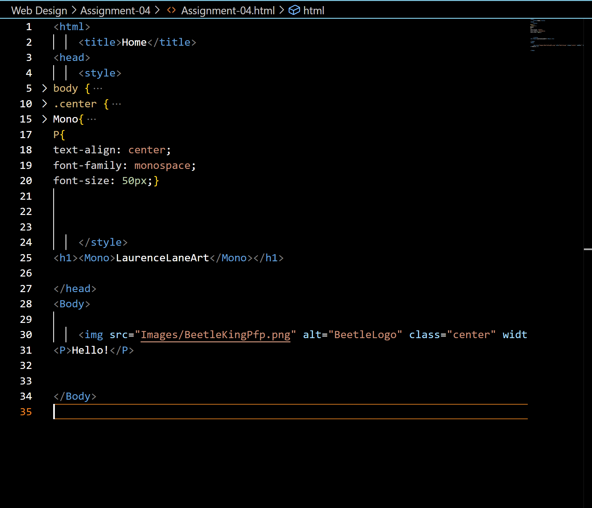

Browsers render HTML, CSS, ect. from the web to show a site in a legible, visual, form on users' screens. I primarily use Chrome when using the internet.

<a href="Images/Screenshot-04.png">Screenshot</a>

)
