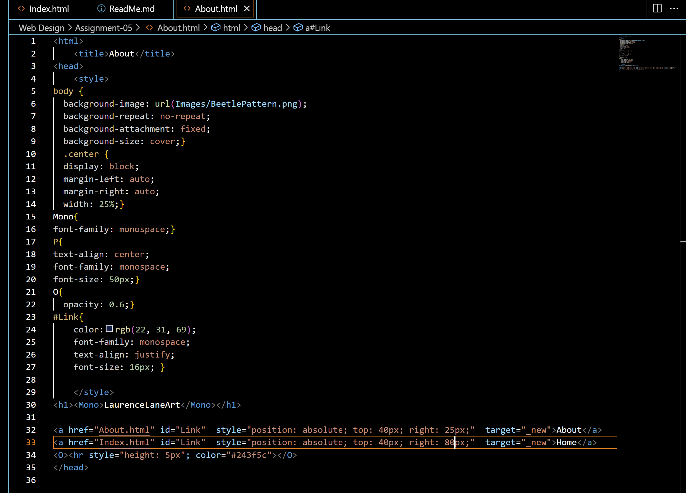

I decided to go back to 2013's tumblr, it was one of my go-to sites back in middle school. It was a lot less user friendly back then, but the website is also known for its users running the net worth of the site into the ground when threatened with change. There's layout changes, posts are all shorter than they are now, cutting off much faster and needing you to click on them to see the full post. 

<a href="Images/Screenshot-05.png">Screenshot</a>

)