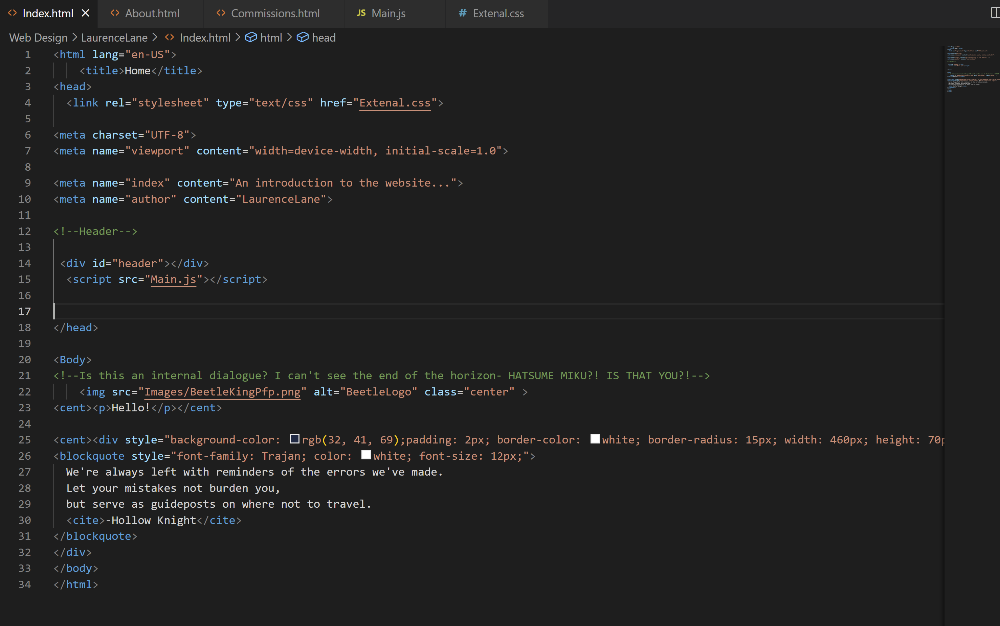

What is an affordance?

    Afforadances are the parts of a button, or other item, that instructs the user on how it is used and what it does.

What are the advantages and disadvantages of using a third-party service like YouTube or Vimeo to host your videos?

    With 3rd parties, you don't have to hold such large files on your site itself as hosting sites usually have a much smaller limit than the average video. The downside of that is that your video can be taken down by the hosting site, breaking the video on your site.

<a href="Images/Screenshot-08.png">Screenshot</a>

