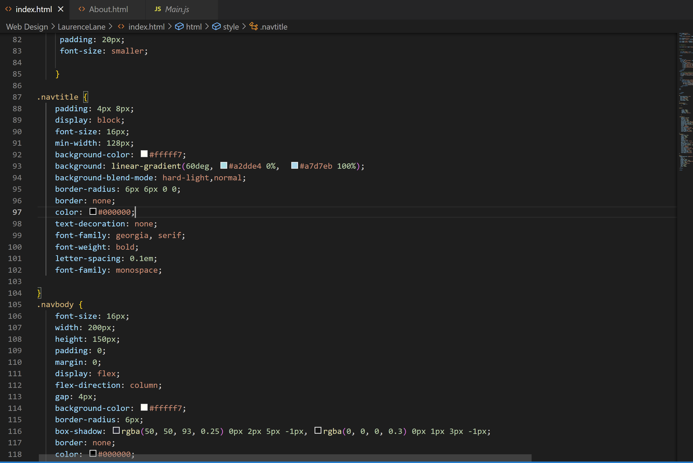

Describe the difference between the universal, element, class, and id selector types. When might you choose one over the other to style content?

Universal selector affects every item on a page unless it's overridden by another selector. Element selectors affect every element of the selected type, class is used independant of element type, allowing you to style items so they're clearly connected. Finally, id selectors are much like class selectors, only using their ID instead, allowing it to also be called by a function.

Discuss your color palette. How did you choose your colors?

    I chose to go with primarily blues with accents of green and orange. I really love earthy tones, so they're sprinkled in there as well. I tend to lean towards cooler colors in my work, so I kept that theme. Orange and blue are complementrary colors and while I don't like large areas of it, it really pops in small doses. 

<a href="Images/Screenshot-10.png">Screenshot</a>

