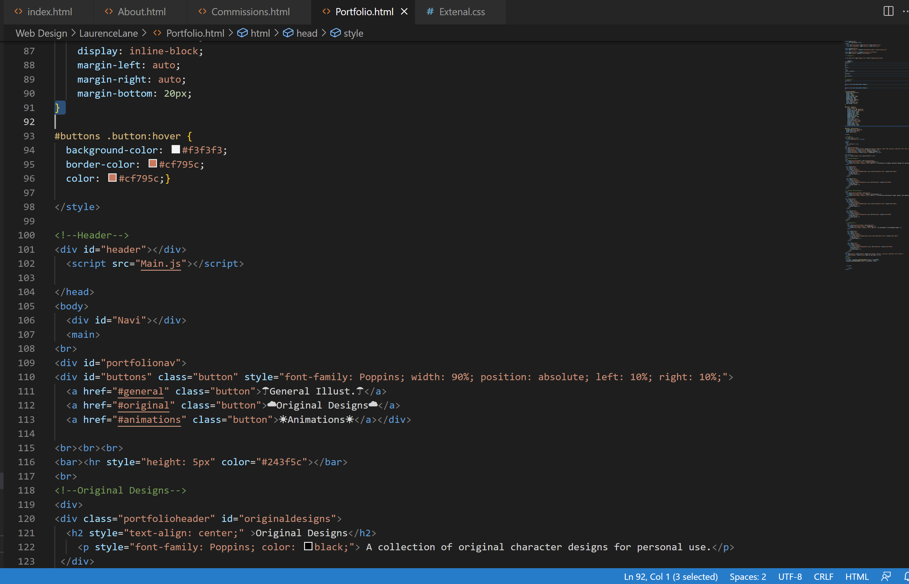

What is typography?

    Typography is the art form of using the arrangement, font, size, and other aspects of a peice 
    of text to make it visually appealing.

What is the importance of having fallback fonts or a font stack?

    When the first choice of font isn't avaliable for the veiwer, fallback fonts are a backup to 
    allow the text to be seen despite the original font not being avaliable. 

What is the difference between a system font, web font, and web-safe font?

    System fonts are fonts that are already installed in every computer/device upon startup, 
    web-safe fonts are these same fonts. Web fonts are ones the browser downloads as the website is loading. 

<a href="Images/Screenshot-11.png">Screenshot</a>

