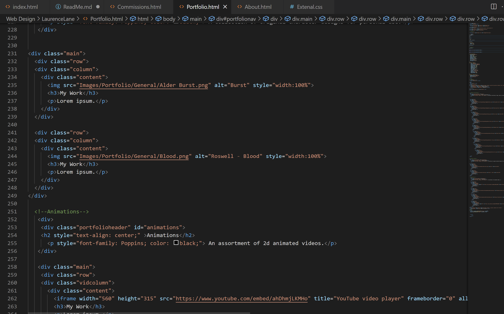

What is the difference between padding, margin, and borders?
    Borders are the outline of items on a website and can be changed in their line type and color. Padding is width between the content of an element and their border, meanwhile margins are used to space elements apart outside their border. 

Optional: how did this week's assignment go? What challenges did you face, and how did you overcome them?
    Since I had already made the dropdown menu, that part was pretty easy. I had more difficulty in figuring out what else I wanted to put on my site. I ended up looking at websites with aesthetics based on sites from the early 2000's since I'm constantly torn between making my website like those, or keeping it clean and fairly serious. 

<a href="Images/Screenshot-12.png">Screenshot</a>

