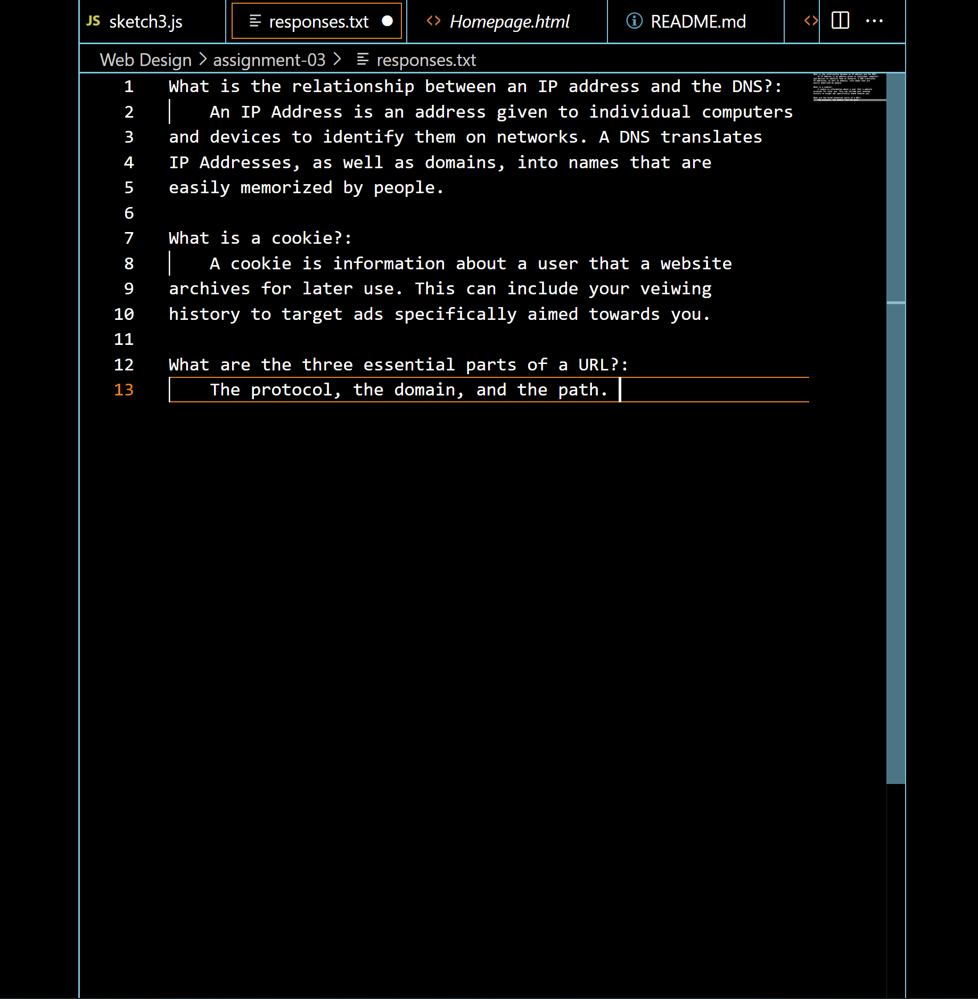

# Read Me
1. 
    a. I've learned the basics of Markdown.
   
    b. What an IP address is beyond the abstract concept.
   
    c.How to link to other files in a directory.
2.

    <a href="responses.txt">Responses</a>

    <a href="images/Screenshot-03.png">Screenshot</a>

    
